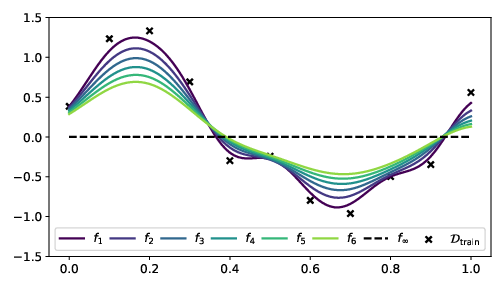
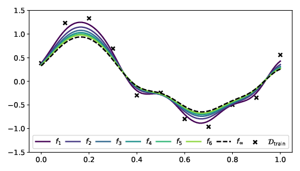
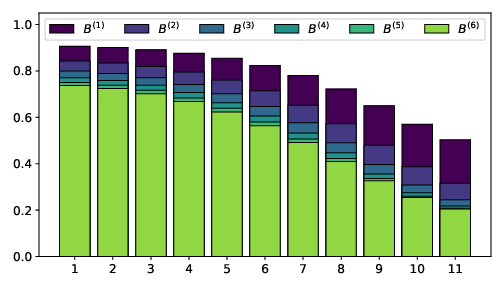

# Self-Distillation with ResNet and Kernel Ridge Regression
The following repository contains the code to replicate the toy-example ([`toy_example.ipynb`](toy_example.ipynb)) from our self-distillation paper _"Even your Teacher Needs Guidance: Ground-Truth Targets Dampens Regularization Imposed by Self-Distillation"_, and code to reproduce our experiments with CIFAR-10 and ResNets ([`self_distiller.py`](self_distiller.py)).


### Install Environment
In order to run our code you need to install the conda environment `selfdistill` with the needed packages:
```{bash}
conda env create --file environment.yml
```
Activate the environment:
```{bash}
conda activate selfdistill
```

### Run ResNet Experiments
To replicate the experiments reported in the paper, use something like the following command:
```{bash}
python self_distiller.py \
--seed 1 \
--deterministic \
--max_epochs 75 \
--batch-size 16 \
--alpha 0.6 \
--distillation-steps 5 \
--resnet 50 \
--lr 1e-4
```
Note, a large variety of options exist, both for training and network specifications, but the main interest of this paper has been on evaluating the effect of different `alpha` during multiple distillation steps. See our paper for more details.

## Illustrative example
The data we are using is identical to that of Mobahi (2020) and is 11 points simulated from a sinusoid plus some normally distributed noise. Initially, we perform self-distillation without the ground-truth (i.e. `alpha = 0`) with the RBF kernel with `gamma=80` and `lambd = 2e-1`. This is somewhat comparable to Mobahi (2020), with a different kernel. The first fit, the following five distillation steps and the limiting solution (zero-function) can be seen below.



Now if we keep the same settings, except setting `alpha = 0.35`, then we see that the inclusion of the ground-truth dampens the regularization imposed by the distillation procedure, and we obtain a much more stable distillation procedure. Furthermore, the solutions no longer converge to the zero-function, but rather to some non-zero solution.



If we compare the losses associated to the above two procedures, we notice, how the former changes drastically between each iteration, whereas the latter is much more stable. Furthermore, the second actually improves performance in all six distillation steps, compared to the first fit, whereas the former performs worse for some distillation steps. Note, the reported loss is w.r.t. the underlying (true) sinusoid and not the training data.

Step  | Loss (`alpha = 0`) | Loss (`alpha = 0.35`)
:---: | :---               | :---
1	    | 0.16477            | 0.16477
2	    | 0.15076            | 0.15424
3  	  | **0.14915**        | 0.15089
4	    | 0.15561            | 0.14983
5	    | 0.16735            | **0.14954**
6	    | 0.18251            | **0.14948**
...   | ...                | ...
∞     | 0.49505            | **0.14959**

Note, the limiting solution in the `alpha = 0.35` case yields comparable performance to that obtained after 5-6 distillation steps, but is computable without the explicit distillation of the model. Furthermore, whereas the initial experiment (`alpha = 0.0`) imposed increased regularization at each iteration, the latter case (`alpha = 0.35`) allow for an adapted regularization, and eventually obtain the better solution after enough iterations (due to the linear convergence of the limit, we experience that the solution converge quite quickly to the limit; i.e. typically in 10-20 iterations).

### Sparsification of solution
It was shown in Mobahi (2020) that the solution sparsifies with each distillation step when `alpha = 0`, and we have extended this result to include all alpha in [0,1]. For `alpha = 1`, the result is not interesting, but the remaining cases are. If we calculate the diagonal B matrices for the above examples and plot the diagonal for each step, we get the following two plots.

First for `alpha = 0`, we see that the smaller diagonals decrease faster than the larger diagonals.


For `alpha = 0.35`, we also observe a decrease in the magnitudes, where the smaller diagonals decrease faster than the larger diagonals. However, the rate of decrease is significantly lower than the previous example.


Furthermore, if one were to continue the distillation procedure, the first example would eventually collapse to all zeros, whereas the latter is more or less converged, and will not change much from the current image.

## Citation
If you find this repository and/or paper useful for your research, please consider citing the paper:
```{bibtex}
@misc{borup2021teacher,
      title={Even your Teacher Needs Guidance: Ground-Truth Targets Dampen Regularization Imposed by Self-Distillation}, 
      author={Kenneth Borup and Lars N. Andersen},
      year={2021},
      eprint={2102.13088},
      archivePrefix={arXiv},
      primaryClass={cs.LG}
}
```
